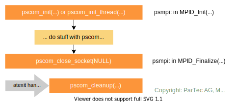
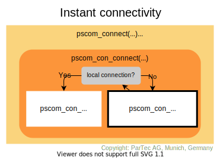
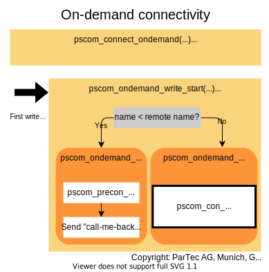
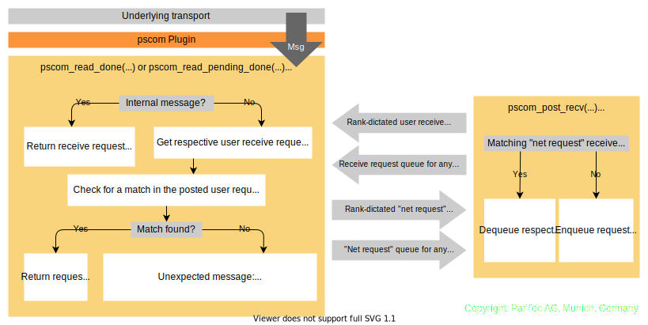
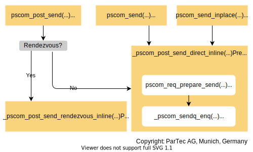

# API and Internals

## Contents
- [Initialization](#initialization)
- [Clean up](#clean-up)
- [Connection establishment](#connection-establishment)
- [Initial information exchange via TCP](#initial-information-exchange-via-tcp)
- [Message reception](#message-reception)
- [Message sending](#message-sending)
- [Plugin Interface](#plugin-interface)

A bi-directional point-to-point connection of `pscom` consists of the following components:
* A `pscom` socket (as a central data structure for establishing and handling connections) to which the connection belongs
* State of the connection
* Type of the connection (corresponding to the respective plugin, an on-demand connection, or a precon)
* Connection info of the connected peer process
* Size of the user-defined storage within this connection
* User-defined storage (user data)

For the type definition of `PSCOM_connection` see `include/pscom.h`.

## Initialization

* Before any other call to the `pscom` library can be made, `pscom_init(...)` (or `pscom_init_thread(...)` for a thread-safe version of the library) has to be called.
* In ParaStation MPI, this call is done in the `MPID_Init(...)` method.

## Clean-up
* At the exit of the program, `pscom` automatically calls the `pscom_cleanup()` function via an [`atexit`](https://man7.org/linux/man-pages/man3/atexit.3.html) handler to close all remaining sockets and clean-up all remaining data including the plugins (see below)
* For `pscom` versions >= 5.5.0-1 there exists an experimental config option `PSP_FINALIZE_SHUTDOWN` in ParaStation MPI. If this option is set to 1,  all `pscom` sockets are closed via `pscom_close_socket(NULL)` in ParaStation MPI during `MPID_Finalize()`. This implies a synchronized shutdown of all pscom connections before the exit handler is called.

## Connection establishment

- A socket is opened (per rank) using `pscom_open_socket(...)` and assigned a unique name using `pscom_socket_set_name(...)`.
- For connection establishment, the following `pscom` functions are used:
    - `pscom_open_connection(...)` to create the connection (malloc)
    - `pscom_connect_socket_str(...)` to establish the connection, calls `pscom_connect(...)` or `pscom_connect_ondemand(...)` depending on the chosen connectivity schema
-  `pscom_send(...)` can be used to send the init message via the established connection

### Instant connectivity

* `pscom_connect(...)` calls `pscom_con_connect(...)` to establish the connection
    - either via loopback for local connection using `pscom_con_connect_loopback(...)`
    -  or initially via TCP (`pscom_con_connect_via_tcp(...)`, see below) and then use TCP to establish a better (the best) connection depending on the available plugins and their priorities
    - Plugins can use the TCP connection to communicate the required information for connection establishment in their own `con_connect(...)` function (part of the plugin)
* To wait for and accept incoming connections, the following function is used:
    - `pscom_wait_any()` to wait for progress/ activity on any communication channel (polling, see `pscom_progress(...)` and `pscom_con_accept(...)`)
    - Also when accepting incoming connections, the best connection plug-in is determined

### On-demand connectivity &ndash; `PSP_ONDEMAND=1`

* Since version >= 5.0.24, on-demand connections are supported by `pscom`.
* On-demand connections are enabled by setting the environment variable `PSP_ONDEMAND=1`
* `pscom_con` objects are initializedby calling `pscom_connect_ondemand(...)` in `pscom_connect_socket_str(...)` which calls `pscom_con_connect_ondemand(...)`
* Upon the first write attempt on this connection, the `pscom_ondemand_write_start(...)` function will trigger connection establishment
* If the own name is (lexicographically) lower than the remote name, indirect connection establishment is done via `pscom_ondemand_indirect_connect(...)`
    - Calling `pscom_precon_tcp_connect(...)` to create a TCP connection
    - If the connect via TCP does not succeed, there are three possible reasons
        1. Problems to connect, caused by network congestion or busy peer (e.g., TCP backlog too small). In this case the connection should be terminated with an error.
        2. Peer is connecting to us at the same time and the listening TCP port is already closed. This is not an error and we must not terminate the connection.
        3. Peer has no receive request on this connection and is not watching for POLLIN on the listening file descriptor. This is currently unhandled and causes a connection error
    - If the TCP connection is successful, send "call-me-back" message via `pscom_precon_send_PSCOM_INFO_CON_INFO(...)` as a trigger
* If the own name is (lexicographically) greater or equal to the remote name direct connection establishment is done via `pscom_ondemand_direct_connect(...)`
    - Closing the "on demand" connection via `pscom_ondemand_cleanup(...)`
    - Re-opening TCP via `pscom_con_connect_via_tcp(...)` (finding the best connection/ plugin)

## Initial information exchange via TCP
- After a TCP connection has been established, some initial information such as the version number or whether it is a "call-me-back" (aka "back-connect") on-demand connection is exchanged
- The sending of the info messages is done asynchronously via the handling of `ufd_events`
- In `pscom_con_connect_via_tcp(...)` the function `pscom_precon_handshake()` is called to
    1. enable receiving
    2. send initial connection information for any connection that is in the state `PSCOM_CON_STATE_CONNECTING`
    3. call the plugin's handshake function

## Message reception

### Network side &ndash; message reception from underlying transport

* Upon arrival of any new data at the underlying transport, the respective plugin calls `pscom_read_done(...)` or `pscom_read_pending_done(...)`
* Checks for a new header (`header_complete(...)`) and begins to consume the data via `_pscom_get_recv_req(...)`
    - Checks message type and returns a request that will receive the message
    - For the internal message types see `lib/pscom/pscom_io.h`
* In case of user message type `PSCOM_MSGTYPE_USER`
    - Get the respective user recv request based on callback for "receive_dispatch" (see ParaStation MPI's `mpid_irecv.c`); creates a user request according to information given in Xheader
    - Check for a match in the posted user requests (Queue: `recvq_user`)
    - If no user request can be found (= unexpected message) create a "net request" and add it to both net queues (`net_recv_userq` and `genrecvq_any`)

### Application side &ndash; post a receive request
- `pscom_post_recv(...)` posts a non-blocking receive request
- First, the function checks whether a matching request has already been received (Queue: `net_recv_userq`); There are two queues for "net requests" (network side)
    * `con->net_recvq_user`: rank dictated
    * `sock->genrecvq_any`: any source
- If no matching request has already been received, the receive request is enqueued in one of the two available user request queues (application side)
    * `con->recvq_user`: rank dictated
    * `sock->recvq_any`: any source
- If a matching message has already been received (on network side, identified by ivoking the user-callback-accept function: `req->pub.ops.recv_accept`) in whole or partial, the respective "net request" is dequeued and merged with the user request
- Enqueue request and "activate" connections if needed

## Message sending
### Application side &ndash; post a send request

- There are three types of non-blocking send functions on application level (see also `include/pscom.h`)
    * `pscom_post_send(...)`: requests-based
    * `pscom_send(...)`: copy-based
    * `pscom_send_inplace(...)`: callback-based
- For example, the PSP layer of ParaStation MPI uses
    * `pscom_send(...)` for control messages (for example in ParaStation MPI's `MPID_PSP_SendCtrl(...)`)
    * `pscom_post_send(...)` for regular MPI payload messages
- Only `pscom_post_send(...)` differentiates between EAGER (direct send) and RNDV (Rendezvous) by comparing the message length with the rendezvous size (a threshold, see below)
- All functions (also `pscom_send(...)` and `pscom_send_inplace(...)`) eventually prepare an internal request and post it to the send queue (see `lib/pscom/pscom_io.c`) with the function `pscom_post_send_direct(...)`
    * Calls `pscom_req_prepare_send(...)` to build the header and iovec
    * Then calls `_pscom_sendq_enq(...)` to enqueue the request
- For queue handling, see `lib/pscom/pscom_queues.c`
- For possible request status, see `include/pscom.h`

### Network side &ndash; ReNDezVous mechanism (RNDV)

The rendezvous mechanism of `pscom` is currently subject to revision.
This documentation will be updated as soon as the revision is completed.

## Plugin Interface

The `pscom` maintains a global list `pscom_plugins` that contains the available plugins. A plugin consists of:
* Name (8 characters), version and ID
* Default and user priorities
* Function pointers to init and destroy the plugin itself
* Function pointers to hook functions that are called when a socket is created or destroyed (see also `pscom_sock_create()` and `pscom_sock_destroy()`) to perform plugin-specific init / destroy steps
* Function pointer to init `pscom` connection
* Function pointer to perform connection handshake of `pscom`
* Pointer to next plugin in the list

For the type definition see `lib/pscom/pscom_plugin.h`.

### Initialization
All enabled plugins are tried to be loaded and initialized upon the first creation of a `pscom` socket during `pscom_plugins_sock_init(...)` method (in `pscom_plugins_init(...)`) using the plugin's respective `init()` method.
Plugin-specific initialization of the socket is done afterwards using the plugin's `sock_init()` hook function.

### Clean-up
All plugins are destroyed during `pscom_cleanup(...)` after the plugin-specific clean-up via `pscom_plugins_sock_destroy(...)` has been performed for all sockets using the `sock_destroy(...)` hook function of the plugins.
Afterwards, the plugin itself is destroyed using its `destroy(...)` method (in `pscom_plugins_destroy(...)`).

### Accessing a plugin
* Access to a specific plugin from the list is provided via plugin name or ID
    * `pscom_plugin_by_name(...)`
    * `pscom_plugin_by_archid(...)`
* Access to the first or next plugin in the list is provided via
    * `pscom_plugin_first()`or
    * `pscom_plugin_next(...)` methods, respectively

